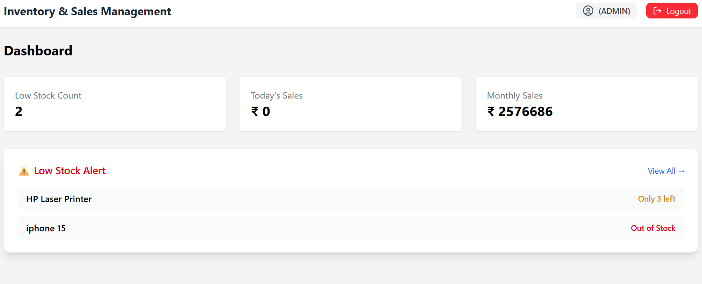
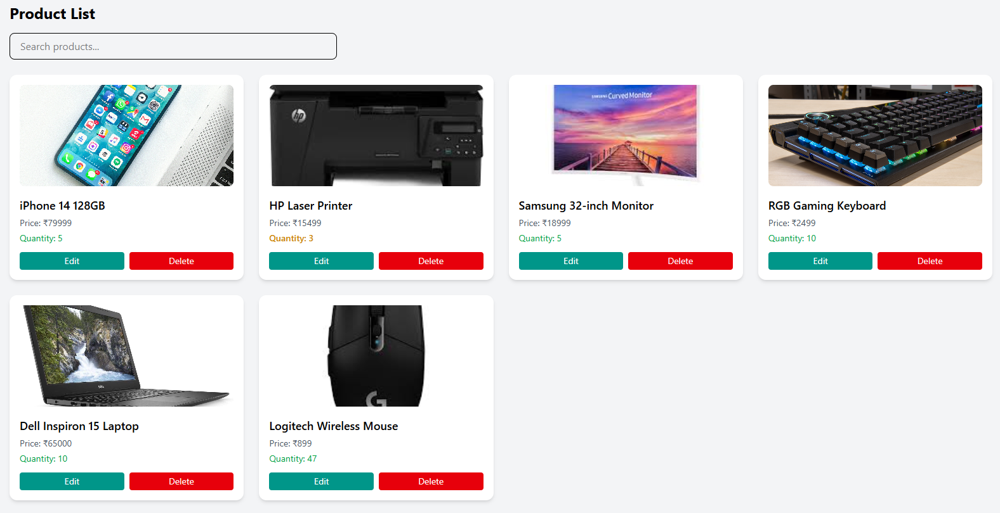
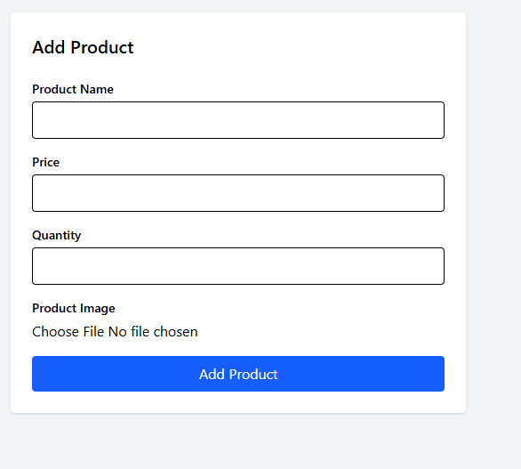
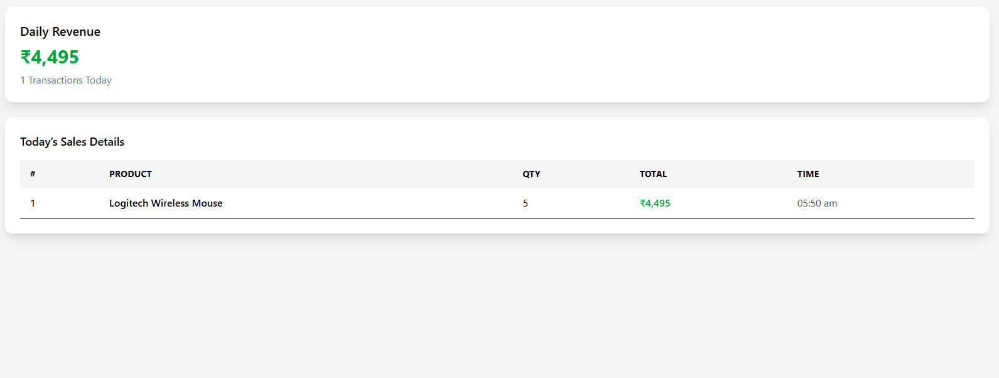

# 📦 Inventory & Sales Management System

A full-stack Inventory & Sales Management System built using **Spring Boot (Backend)** and **React + Vite (Frontend)** with **JWT Authentication**, **Role-Based Access Control**, and **PostgreSQL (Neon DB)**.  
The application is deployed using **Render (Backend)** and **Netlify (Frontend)**.

---

## 🚀 Live Demo

Frontend: [https://your-netlify-site.netlify.app](https://inventory-sales-app.netlify.app)  
Backend API: [https://your-render-backend.onrender.com](https://app-deployment-hk0t.onrender.com)

---
## 🔐 Login Credentials

To access the application, use the following credentials:

### 👤 Admin
- Username: `admin`
- Password: `admin123`

### 👥 Staff
- Username: `staff`
- Password: `staff123`

---
## 🔐 Authentication & Roles

The application implements secure JWT-based authentication with Role-Based Access Control.

### 👤 Admin
- Dashboard with analytics
- Add, Update, Delete Products
- Upload Product Images
- Create Sales
- View Sales
- Daily & Monthly Reports
- Low Stock Monitoring

### 👥 Staff
- View Products
- Create Sales
- View Sales
- Low Stock Monitoring
- No access to product modification or reports

---

## 🛠 Tech Stack

### 🔹 Frontend
- React (Vite)
- React Router
- Axios
- Tailwind CSS
- Lucide Icons

### 🔹 Backend
- Spring Boot
- Spring Security
- JWT Authentication
- REST APIs
- File Upload (Multipart)
- Role-Based Authorization

### 🔹 Database
- PostgreSQL (Neon)

### 🔹 Deployment
- Backend → Render
- Frontend → Netlify

---

## 📊 Features

- Secure Login with JWT
- Role-Based Access Control
- Product Image Upload
- Real-Time Inventory Tracking
- Sales Management
- Low Stock Alerts
- Dashboard Summary
- Daily & Monthly Sales Reports
- Protected API Routes
- Production Deployment

---

## 🖼 Application Screenshots

### 🔐 Login Page


---

### 📊 Admin Dashboard


---

### 📦 Product List


---

### ➕ Add Product (Image Upload)


---

### 💰 Create Sale


---
### 📋 View Sales


---

### 📅 Daily Report


---
### 📈 Monthly Report


---

## ⚙️ Installation (Local Setup)
### 1️⃣ Clone Repository
```
git clone https://github.com/your-username/inventory-sales-management.git
```
### 2️⃣ Backend Setup
```
cd Backend
mvn clean install
mvn spring-boot:run
```
### 3️⃣ Frontend Setup
```
cd inventory-ui
npm install
npm run dev
```
### 🔑 Environment Variables
## Backend (.env / Render)
```
DATASOURCE_URL=your_neon_db_url
DATASOURCE_USERNAME=your_username
DATASOURCE_PASSWORD=your_password
FRONTEND_URL=https://your-netlify-site.netlify.app
```
## Frontend (.env)
```
VITE_API_URL=https://your-render-backend.onrender.com
```
### 🔒 Security Highlights
- Stateless JWT Authentication
- Spring Security Filter Chain
- Role-Based Method Authorization
- Protected API Endpoints
- Secure CORS Configuration
- Password Validation via Authentication Service

### Architecture Overview
```
React Frontend → Axios → Spring Boot REST API → Neon PostgreSQL
                    ↓
                JWT Authentication
                    ↓
            Role-Based Authorization
```
## 📄 License
This project is for educational and demonstration purposes.
